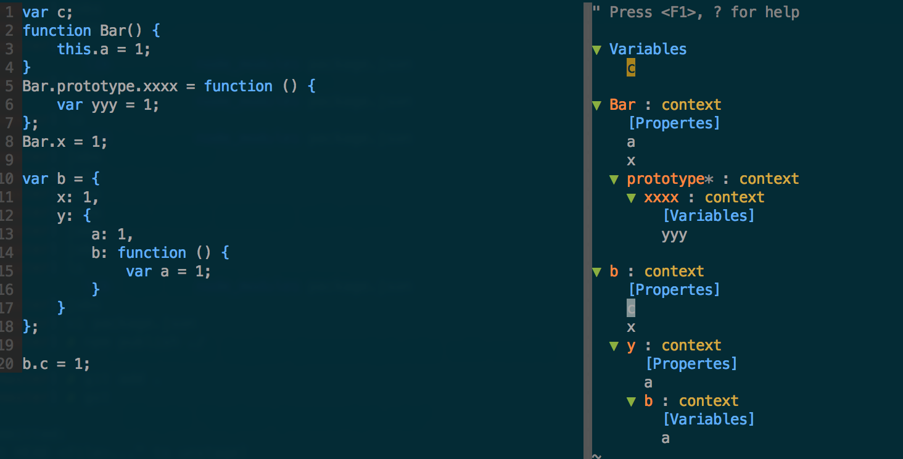
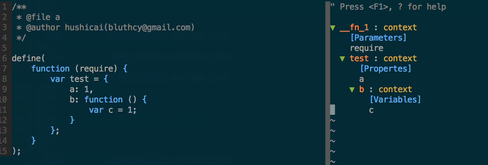
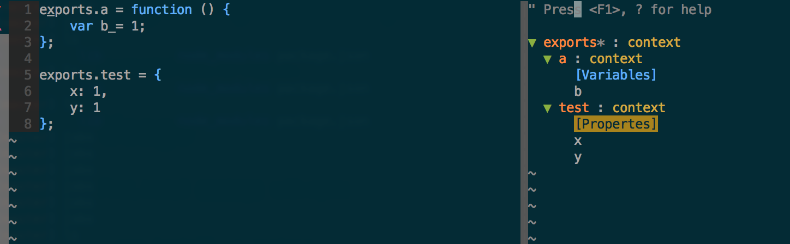

# tagbar-javascript.vim

javascript tags for tagbar.

## Usage

First, install `es-ctags` with npm:

```bash
npm install -g es-ctags
```

Then, install `tagbar-javascript.vim` with vundle:

```vim
Plugin 'hushicai/tagbar-javascript.vim'
```

Now, enjoy it.

## Screenshots

### Simple



### amdjs



### nodejs


